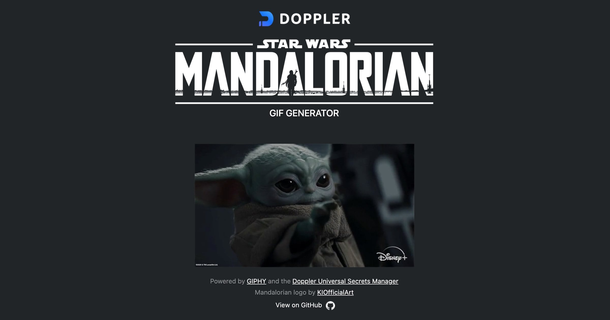

# Vercel Mandalorion GIF Generator



This repository is for demonstrating [Vercel's official Doppler integration](https://vercel.com/integrations/doppler). Also check out [Doppler's Vercel integration docs](https://docs.doppler.com/docs/vercel).

<a href="https://dashboard.doppler.com/workplace/template/import?template=https%3A%2F%2Fgithub.com%2FDopplerUniversity%2Fmandalorion-gifs-vercel%2Fblob%2Fmain%2Fdoppler-template.yaml"/></a>

[](https://vercel.com/new/git/external?repository-url=https%3A%2F%2Fgithub.com%2FDopplerUniversity%2Fmandalorion-gifs-vercel&env=GIPHY_TAG,GIPHY_RATING&envDescription=Click%20Learn%20More%20to%20view%20default%20environment%20variable%20values&envLink=https%3A%2F%2Fgithub.com%2FDopplerUniversity%2Fmandalorion-gifs-vercel%2Fblob%2Fmain%2Fsample.env&project-name=doppler-mandalorion-gifs&repo-name=mandalorion-gifs-vercel&redirect-url=https%3A%2F%2Fdashboard.doppler.com%2F&developer-id=oac_PwsovDZUAMuUygRu6bp4AMme&integration-ids=oac_UdMtwPpcN7yXVQsZFvMSQFy5)

## What is Doppler?

[Doppler](https://doppler.com/) is a Universal Secrets Manager, designed to make developers lives easier by removing the need for env files, hardcoded secrets, and copy-pasted credentials.

The [Doppler CLI](https://docs.doppler.com/docs) provides easy access to secrets in every environment from local development to production and a single dashboard makes it easy for teams to centrally manage app configuration for any application, platform, and cloud provider.

Learn more at our [product website](https://doppler.com) or [docs](https://docs.doppler.com/docs/).

## Local development

We recommend deploying this repository to Vercel to learn about Doppler's official secrets sync integration, but in case you want to run the app locally, follow the instructions below.

### Requirements

- Node.js
- Git
- Make
- [Doppler CLI](https://docs.doppler.com/docs/enclave-installation) (used to manage environment variables)
- [Vercel CLI](https://vercel.com/download)
- Vercel CLI
- Create a GIPHY app in order to generate an API (not SDK) key ([see instructions](https://developers.giphy.com/docs/api/#quick-start-guide))

## Getting started

> NOTE: This guide presumes you already have Node, Make, and Git installed

1. Clone the [Mandalorion GIFs Vercel repo](https://github.com/DopplerUniversity/mandalorion-gifs-vercel):
```sh
git clone https://github.com/DopplerUniversity/mandalorion-gifs-vercel
```

2. Install the required Node dependencies:
```sh
npm install
```

2. [Install the Doppler CLI](https://docs.doppler.com/docs/enclave-installation):
```sh
# See https://docs.doppler.com/docs/enclave-installation if not on macOS
brew install dopplerhq/cli/doppler
```

3. Login and create your free Doppler account on the Community plan:
```sh
doppler login
```

5. Create the Doppler project which sets secrets for all environments (optionally providing the [GIPHY API KEY](https://developers.giphy.com/docs/api/#quick-start-guide):
```sh
# If you have an API Key
make create-doppler-project GIPHY_API_KEY=YOUR_KEY_HERE

# Or if not
make create-doppler-project
```

6. [Create a new Vercel application](https://vercel.com/new), selecting the **DopplerUniversity/mandalorion-gifs-vercel** repository.

7. Open the Doppler dashboard (`doppler open`), navigate to the **dev** environment for the **mandalorion-gifs** project, then enable the **Vercel** integration, syncing the Doppler **dev** environment with Vercel's **development** environment.

8. Check that Doppler successfully synced your secrets by opening the [Vercel dashboard](https://vercel.com/), navigate to your project, then go to **Settings** > **Environment Variables** and filter the environment variables by **Development**. You should see your secrets synced from Doppler, as well as three Doppler set environment variables.

### Run app locally

Once your secrets are in the Vercel development environment, you should be able to run the app locally by running:

```sh
npm run vercel-dev
```

This will dynamically fetch the secrets synced from to Vercel's development environment.
